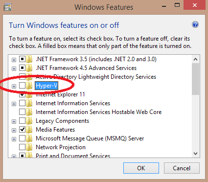

# poc-vagrant-mssql

Proof of Concept to install MS SQL Server in a Vagrant Linux box

## Installation

- [VirtualBox](https://www.virtualbox.org/wiki/Downloads).
- [Vagrant](https://www.vagrantup.com/downloads.html).
- [VB Guest Vagrant plug-in](https://github.com/dotless-de/vagrant-vbguest) in order to update _Guest additions_ automatically.

    ```sh
    vagrant plugin install vagrant-vbguest
    ```
- [Git for Windows](https://git-scm.com/download/) to get access to SSH commands.

**Note**: Vagrant boxes are located in `~/.vagrant.d/boxes/` (Linux) or `C:\Users\<your-login>\.vagrant.d\boxes\` (Windows).

- We use CentOS because MS SQL for Linux is only packaged for Red Hat.
- Docker has been rejected because it only runs on Windows 10 Pro.

### Troubleshooting

#### Cannot download box

If `vagrant up` cannot download box, it may be because of embedded `curl`.


```
The box 'hashicorp/precise64' could not be found or
could not be accessed in the remote catalog. If this is a private
box on HashiCorp's Atlas, please verify you're logged in via
`vagrant login`. Also, please double-check the name. The expanded
URL and error message are shown below:

URL: ["https://atlas.hashicorp.com/hashicorp/precise64"]
Error:
```

**Solution**: Delete embedded `curl`:

- MacOS: `sudo rm -rf /opt/vagrant/embedded/bin/curl`
- Windows:

#### VirtualBox headless mode

```
There was an error while executing `VBoxManage`, a CLI used by Vagrant
for controlling VirtualBox. The command and stderr is shown below.

Command: ["startvm", "3dcac5fa-93aa-44fc-8594-851884e9b269", "--type", "headless"]

Stderr: VBoxManage.exe: error: VT-x is not available (VERR_VMX_NO_VMX)
VBoxManage.exe: error: Details: code E_FAIL (0x80004005), component ConsoleWrap, interface IConsole
```

Hyper-V needs to be turned off:


